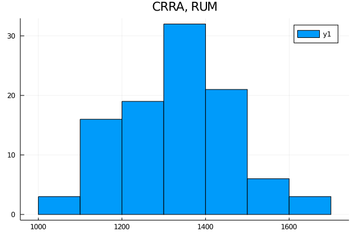
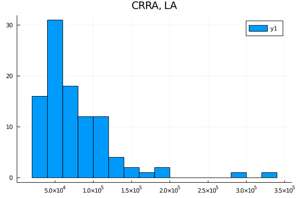

```{r setup, include=FALSE}
knitr::opts_chunk$set(echo = TRUE)
```
## Testing stability across attention frames

1. I test the null hypothesis that 1) random utility model (RUM) that is stable across frames describes the dataset under a random CRRA utility and 2) the dataset is described by the logit attention (LA) model that has a distribution of preferences that is stable across frames under a CRRA utility. The test statistic and p-values for 100 bootstrap replications are displayed in table 1. The distribution of the test statistic is shown in figure 1. We can conclude that we reject the null hypothesis that RUM is stable across frames, but we can not reject that LA with CRRA is stable.

```{r, echo=FALSE}
# getwd()
res<-read.csv("results/results.csv")
row.names(res) <- c("LA","RUM")
knitr::kable(res, caption = "Test statistics")
```

<!-- {width="50%"}{width="50%"} -->


```{r eval=TRUE, echo=FALSE, fig.cap="Distribution of the test statistic", fig.show='hold', out.width="50%"}
knitr::include_graphics(c("figs/CRRA_RUM.png",
                          "figs/CRRA_LA.png"))
```

a. **Theory question:** For $\sigma \in [-1,1]$ and five lotteries $l_i$ $i=1,...,5$ excluding the default alternative, the implied collection of rankings is $R=\{\succ_i\} \text{ for } i=1,..,6$ is the following:

$$
\begin{aligned}
a. \quad l_1 \succ_1 l_5 \succ_1 l_3 \succ_1 l_2 \succ_1 l_4 \\
b. \quad l_2 \succ_2 l_5 \succ_2 l_4 \succ_2 l_1 \succ_2 l_3 \\
c. \quad l_3 \succ_3 l_5 \succ_3 l_4 \succ_3 l_1 \succ_3 l_2 \\ 
d. \quad l_5 \succ_4 l_3 \succ_4 l_4 \succ_4 l_2 \succ_4 l_1 \\ 
e. \quad l_5 \succ_5 l_2 \succ_5 l_4 \succ_5 l_3 \succ_5 l_1 \\
f. \quad l_5 \succ_6 l_1 \succ_6 l_3 \succ_6 l_4 \succ_6 l_2
\end{aligned}
$$

>It is easy to see that with CRRA utility with support [-1,1], R satisfies the **single crossing property** as defined in Apesteguia et al. (2017). In particular, for every pair of lotteries $l_i \succ l_j$ $i \ne j$ $i,j=1,...,5$ and for every  $t > s$, $s \ne t$, $s,t=1,...,6$, whenever $l_i \succ_s l_j$ then $l_i \succ_t l_j$, which is the definition of single-crossing property. Another way to interpret this is that the *single-crossing condition states that the ranking of any pair of alternatives reverses at most once in the ordered collection of preferences with low alternatives opting for the low alternative, and high preferences opting for the high alternative.*

2. The distributions of risk aversion using the CRRA assumption under LA and RUM models are displayed in figure 2. I estimated the distributions by $B'\hat P$ where B is defined as $B=\mathbbm{1}(a \in A)\mathbbm{1}(a \succ_l b, \forall b \in A)$ and $\hat P$ are the realized choice frequencies.

```{r eval=TRUE, echo=FALSE, fig.cap="Distribution of risk aversion under LA and RUM, using CRRA.", fig.show='hold', out.width="50%"}
knitr::include_graphics(c("figs/dist_RUM.png",
                          "figs/dist_LA.png"))
```

a. Using only the high and medium cost treatments, I estimate $\hat v$, where $\hat v = argmin \;||g^L-Gv ||$, with $g^L=(\hat P_{\pi}, m^L)'$ for $L=\{LA, RUM \}$ and high and medium cost treatments only. Then, the predicted distributions of risk aversion are $G'\hat{g}^L$ with $\hat{g}^L=G \hat v$ and taking only the first six observations for the LA model and the first 10 for the RUM model. This implies that there is perfect attention and that the default alternative is the worst. The predictions are displayed in figure 3.

```{r eval=TRUE, echo=FALSE, fig.cap="Distribution of risk aversion under LA and RUM, using CRRA.", fig.show='hold', out.width="50%"}
knitr::include_graphics(c("figs/pred_RUM.png",
                          "figs/pred_LA.png"))
```

b. Lastly, to compare the performance of predictions a natural measure of errors is the square root of the sums of the square of the differences between the data and the predicted values. In particular, 

$$\varepsilon^L= \sqrt{ \sum_{i=1}^{d_i} (\theta_i- \hat{\theta_i}) } $$
where $\theta_i$ is the risk distribution recovered from data and the $\hat{\theta_i}$ are the predictive values. Since in the testing procedure we use a similar computation, the euclidean distance seems appropriate.

Table 2 displays the errors for both models. We can appreciate that the LA model does better than RUM, when using CRRA utility, at predicting the distributions of risk aversion.

```{r, echo=FALSE}
# getwd()
res<-read.csv("results/pred_errs.csv")
row.names(res) <- c("LA","RUM")
knitr::kable(res, caption = "Prediction error")
```
